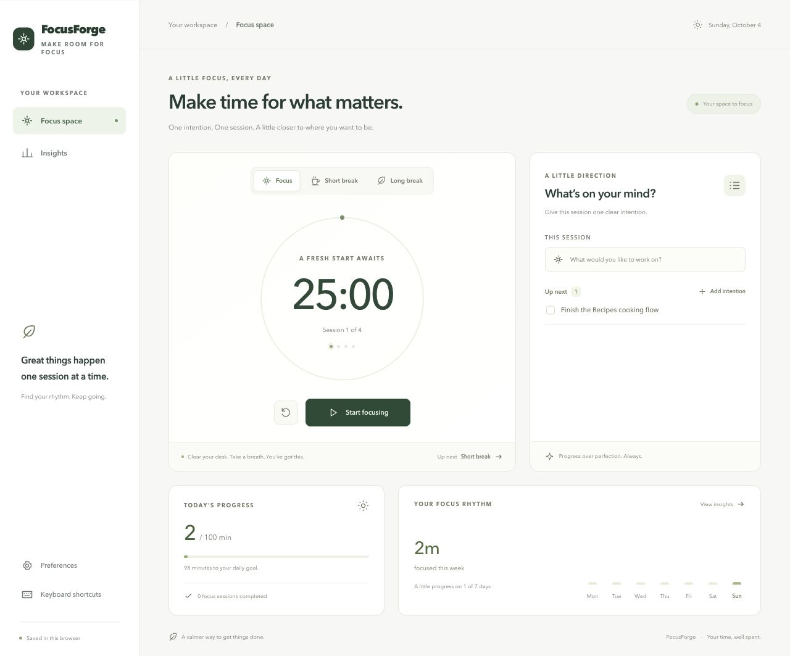
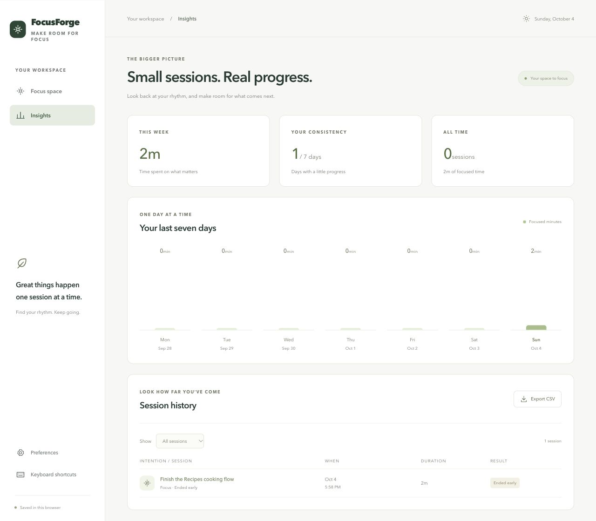

# FocusForge

A calm, local-first workspace for making time for what matters. FocusForge pairs a Pomodoro timer with a short list of intentions, a daily focus goal, and a useful record of your progress. Built with Svelte 5, TypeScript, and Tauri 2.

## A look inside





## What’s here

- A responsive focus workspace with focus, short-break, and long-break modes, session cycle indicators, and an editable intention for each focus session.
- A deadline-based timer that catches up after background throttling or device sleep. Start, pause, resume, and reset; your current timer can recover after a reload or reopening the same app/browser profile.
- Correct long-break progression, configurable durations and daily goals, and optional automatic phase starts.
- A persistent intention list: add, select, complete, reopen, and remove items. A session retains the intention you started with even if you later change your list.
- The option to save time from an unfinished session before resetting or switching phases. Partial time contributes to your focus minutes, while completed-session counts remain separate.
- Seven-day focus insights, daily progress, filterable session history, and CSV export.
- Optional completion chimes and opt-in native or browser notifications. Notification failures do not interrupt saving a session.
- Keyboard shortcuts, visible focus states, focus-trapped dialogs, reduced-motion support, and compact layouts for smaller screens.
- Existing v2 and legacy native statistics migrate to schema v3 with history and valid preferences preserved. Malformed native data is backed up before recovery; future schema versions are left untouched.

## Run

Use Node.js 22.6 or newer (the lightweight TypeScript tests use Node’s built-in type stripping) and npm.

```sh
npm ci
npm run dev
```

Open the Vite URL to use the complete browser version. For the desktop app, install the [Tauri prerequisites](https://tauri.app/start/prerequisites/) and Rust toolchain, then run:

```sh
npm run tauri dev
```

Create the production web build with `npm run build`. Build a native executable without generating installers with `npm run tauri build -- --no-bundle`, or run `npm run tauri build` for the configured platform bundles.

## Your data

There is no account, analytics service, or remote database. Native history, intentions, and preferences are kept in `focus_stats.json` under Tauri’s app data directory. Native commands serialize access to that file, use staged writes, and deduplicate recovered session IDs.

The browser version uses local storage for the same features. Its data belongs to the current browser profile and origin, and is separate from the desktop app’s native data. Clearing browser storage removes browser history and the recoverable timer. CSV export contains session history; it is not a full backup of intentions and settings.

The active timer is recovered from local storage in both versions. Focus time advances while a running session is in the background, but this is not a background operating-system service: an app that is fully closed cannot deliver a notification until it is opened again. An overdue phase is saved once when the app returns, and the next phase starts then if automatic starts are enabled. A paused timer stays paused.

## Shortcuts

| Key    | Action                                      |
| ------ | ------------------------------------------- |
| Space  | Start / pause                               |
| R      | Reset (choose whether to keep partial time) |
| S      | Preferences                                 |
| ?      | Shortcut reference                          |
| Escape | Close a dialog                              |

Shortcuts do not take over text inputs or interfere with normal button keyboard interaction.

## Verify

```sh
npm run check
npm run format:check
npm test
npm run build
cargo test --manifest-path src-tauri/Cargo.toml
```

The frontend tests cover deadline catch-up, break transitions, browser persistence, recovery deduplication, partial-time accounting, settings validation, and corrupt-data preservation. Rust tests cover native migration, recovery, session totals, idempotent writes, and intention validation/persistence.

For an interactive smoke test, add an intention, select it, start and pause a session, reload, and confirm the paused session is restored. Reset and keep the partial time, then check Insights. Change preferences and confirm a current session keeps its original duration. Use Tab and Escape in the dialogs, and check the layout at narrow widths. Notification permission and sound playback depend on the platform and browser settings.

## Structure

- `src/App.svelte` — workspace, timer orchestration, intentions, insights, preferences, and accessibility interactions.
- `src/components/Icon.svelte` — shared vector icon vocabulary.
- `src/lib/appState.ts` — typed persistence adapter for native and browser use.
- `src/lib/timer.ts` — pure timing and phase transition helpers.
- `src-tauri/src/lib.rs` — validated native commands, migration, and persistence tests.
- `tests/` — browser storage and timing regression tests.
- `scripts/generate-icons.py` — reproducible native icon generation from the shared FocusForge mark (Python standard library only).
